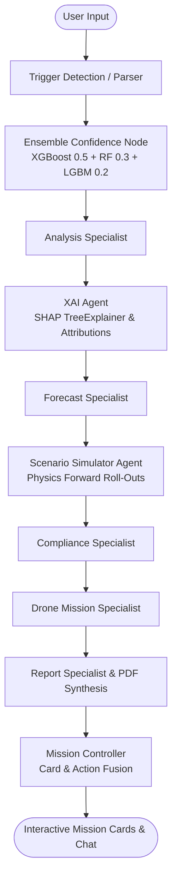

# Multi-Agent Environmental Intelligence System: Ensemble AI, SHAP XAI & What-If Simulator

## 1. Overview & Architecture Preservation

The existing LangGraph multi-agent architecture has been extended with three state-of-the-art capabilities without modifying the core orchestrator or breaking existing downstream APIs:

1. **Feature 1 — Ensemble Learning** (`backend/ml_engine/downscaling/ensemble.py`)
2. **Feature 2 — Explainable AI using SHAP** (`backend/ml_engine/xai/`)
3. **Feature 3 — Physics-Consistent What-If Simulator** (`backend/ml_engine/simulator/`)

---

## 2. Feature 1: Ensemble Learning

- **Module**: [ensemble.py](file:///Users/dhairyapunitjani/Development/Internal%20Hackathon%202026/InternalHackathon/backend/ml_engine/downscaling/ensemble.py)
- **Model Blend**:
  - **XGBoost**: 0.50 (gradient-boosted tree baseline)
  - **Random Forest**: 0.30 (bagged tree variance reducer)
  - **LightGBM**: 0.20 (leaf-wise gradient boosting)
- **Confidence & Agreement Score**:
  $$\text{Disagreement} = \sigma(\hat{y}_{\text{XGB}}, \hat{y}_{\text{RF}}, \hat{y}_{\text{LGBM}})$$
  $$\text{Confidence} = 1.0 - \min(1.0, \frac{\text{Disagreement}}{\mu_{\text{pred}} + \epsilon})$$
- **Frontend Card**: `EnsembleCard` renders an animated SVG confidence dial, individual model weights, and agreement diagnostics.

---

## 3. Feature 2: Explainable AI (SHAP)

- **Module**: [shap_service.py](file:///Users/dhairyapunitjani/Development/Internal%20Hackathon%202026/InternalHackathon/backend/ml_engine/xai/shap_service.py), [charts.py](file:///Users/dhairyapunitjani/Development/Internal%20Hackathon%202026/InternalHackathon/backend/ml_engine/xai/charts.py), [summaries.py](file:///Users/dhairyapunitjani/Development/Internal%20Hackathon%202026/InternalHackathon/backend/ml_engine/xai/summaries.py)
- **Human-Readable Attributions**: Translates complex game-theoretic values into intuitive percentage breakdowns (e.g. *"Road density contributed 41.2%, low wind speed contributed 28.1%, built-up area contributed 17.4%"*).
- **Visuals**:
  - Waterfall charts depicting push/pull relative to the baseline expectation $E[f(x)]$.
  - Horizontal bar plots highlighting top positive and negative drivers.
  - Exported as Base64 PNGs directly embedded into reports and mission cards.

---

## 4. Feature 3: Physics-Consistent What-If Simulator

- **Module**: [scenarios.py](file:///Users/dhairyapunitjani/Development/Internal%20Hackathon%202026/InternalHackathon/backend/ml_engine/simulator/scenarios.py), [runner.py](file:///Users/dhairyapunitjani/Development/Internal%20Hackathon%202026/InternalHackathon/backend/ml_engine/simulator/runner.py), [impact.py](file:///Users/dhairyapunitjani/Development/Internal%20Hackathon%202026/InternalHackathon/backend/ml_engine/simulator/impact.py)
- **No Retraining**: Directly leverages `ImprovedPhysicsSolver` (advection, 2D eddy diffusion, OH chemical loss, rain scavenging).
- **Simulated Levers**:
  - Traffic emission scaling
  - Industrial emission scaling
  - Power plant emission scaling
  - Wind speed & wind direction rotation
  - Boundary Layer Height (BLH) dilution
  - Wet deposition rainfall scavenging
- **Comparative Intelligence Metrics**:
  - $\Delta \text{Peak } \text{NO}_2$ ($\mu\text{g/m}^3$ and $\%$)
  - $\Delta \text{Exposed Population}$ (residents in areas exceeding CPCB 80 $\mu\text{g/m}^3$)
  - Plume Center of Mass displacement ($d$ km, $\theta^\circ$)
  - CPCB Compliance delta (Exceedance $\rightarrow$ Compliant)

---

## 5. Flagship Interactive What-If Simulator Page

- **Frontend Route**: [`frontend/app/simulator/page.tsx`](file:///Users/dhairyapunitjani/Development/Internal%20Hackathon%202026/InternalHackathon/frontend/app/simulator/page.tsx)
- **Dedicated Navigation**: Added to primary desktop navbar and mobile drawers across the application:
  - **Home** (`/`)
  - **Upload** (`/upload`)
  - **Forecast** (`/visualization`)
  - **What-If Simulator** (`/simulator`)
  - **Reports** (`/reports`)
  - **Agent Portal** (`/chatbot`)
- **Government Command Center Layout**:
  - **Left Side**: Environmental and policy sliders (wind speed, wind direction, BLH, rainfall, traffic, industrial, power, construction emissions), plus 1-click policy presets (*Odd-Even*, *Industrial Shutdown*, *Monsoon Washout*, *Wind Stagnation*, *Emergency Stage IV Restrictions*) and individual factory output sliders.
  - **Center**: Interactive Google Maps canvas with real-time Canvas 2D NO₂ heatmap rendering, Baseline vs Simulated before/after comparison toggle, suspicious source markers, and live KPI summary bar (Peak NO₂, Area Mean, Population Protected under CPCB & WHO, Plume Shift Distance).
  - **Right Side**: Permanent live TreeSHAP XAI explainability dashboard with plain-English reasoning summaries, percentage-ranked feature contributions, interactive hotspot intelligence cards, and regulatory compliance flags.
  - **Bottom / Export**: Download button streaming a dedicated high-resolution **Simulation Impact Report PDF**.

---

## 6. Automated & Simulation Impact PDF Reports

- **Module**: [pdf.py](file:///Users/dhairyapunitjani/Development/Internal%20Hackathon%202026/InternalHackathon/backend/ml_engine/report/pdf.py)
- **Unicode Glyph Fixes**: Registered Unicode TrueType fonts (Arial Unicode, Devanagari Sangam, DejaVu Sans) to ensure pristine rendering of:
  - Angles and coordinates: `19.086°N, 72.869°E`
  - Units and symbols: `43 µg/m³`, `m²`, `±`, `×`, `→`
- **Dedicated Simulation Impact Report** (`build_simulation_report_pdf`):
  1. **Before vs. After Comparison Table**: Peak concentrations, average levels, exposed population (CPCB 80 µg/m³ and WHO 25 µg/m³), and plume displacement.
  2. **Applied Policy Levers**: Detailed ledger of emission adjustments applied during the simulation.
  3. **Explainable AI (SHAP)**: Top environmental drivers and executive narrative.
  4. **Suspicious Local Sources & Anomaly Checks**: CPCB compliance check and specific site observations.
  5. **Strategic Recommendations**: Policy and drone deployment guidance.
